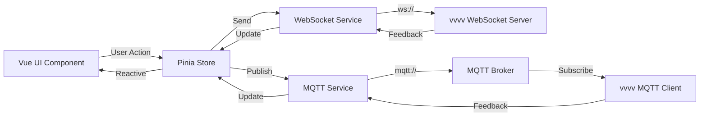

# Vue Webapp Project Summary

## 📋 Project Overview

This project creates a modern Vue 3 webapp that serves as a web-based control interface for vvvv applications. The webapp communicates bidirectionally with vvvv using both WebSocket and MQTT protocols, with all communication logic centralized in Pinia stores.

---

## 🎯 Key Objectives

1. ✅ Initialize Vue 3 project with latest version (using Vite)
2. ✅ Implement WebSocket communication for real-time control
3. ✅ Implement MQTT communication for pub/sub messaging
4. ✅ Create comprehensive UI control components
5. ✅ Centralize all communication in Pinia stores
6. ✅ Provide professional UI using Element Plus framework

---

## 📚 Documentation Structure

### 1. [`webapp-architecture.md`](plans/webapp-architecture.md)
**Purpose**: High-level architecture and design decisions

**Contents**:
- Vue UI framework recommendations (Element Plus, Vuetify, PrimeVue, etc.)
- Technology stack overview
- Architecture diagrams (Mermaid)
- Project structure
- Communication protocol design
- Development phases
- Security considerations

**Key Recommendation**: **Element Plus** for UI framework

### 2. [`implementation-guide.md`](plans/implementation-guide.md)
**Purpose**: Step-by-step implementation instructions

**Contents**:
- Quick start commands
- Configuration file templates
- Code patterns and examples
- Message protocol specifications
- Component specifications
- Development workflow
- Testing tools and resources
- Common issues and solutions
- Performance optimization tips

**Key Commands**:
```bash
cd Webapp
npm create vue@latest . -- --typescript --router --pinia
npm install element-plus mqtt @vueuse/core
npm run dev
```

### 3. [`vvvv-integration-guide.md`](plans/vvvv-integration-guide.md)
**Purpose**: vvvv-specific integration instructions

**Contents**:
- vvvv package requirements
- WebSocket server setup in vvvv
- MQTT client setup in vvvv
- Example vvvv patches
- Topic mapping
- Data type conversions
- Testing procedures
- Debugging tips
- Use cases and examples

**Key Packages**:
- Built-in WebSocket nodes
- VL.IO.MQTT package (via nuget)

---

## 🏗️ Technology Stack

### Frontend Framework
- **Vue 3** (Composition API with `<script setup>`)
- **Vite** (Build tool and dev server)
- **TypeScript** (Type safety)

### State Management
- **Pinia** (Vue's official state management)

### UI Framework
- **Element Plus** (Comprehensive component library)
- **Unplugin Auto Import** (Auto-import components)

### Communication
- **Native WebSocket API** (Real-time bidirectional)
- **mqtt.js** (MQTT over WebSocket)

### Utilities
- **VueUse** (Composition utilities)
- **Vue Router** (Navigation)

---

## 📁 Project Structure

```
Webapp/
├── src/
│   ├── components/
│   │   ├── ui/                    # Reusable UI controls
│   │   │   ├── ButtonControl.vue
│   │   │   ├── SliderControl.vue
│   │   │   ├── ToggleControl.vue
│   │   │   ├── ColorPicker.vue
│   │   │   ├── TextInput.vue
│   │   │   └── NumberInput.vue
│   │   └── ConnectionStatus.vue   # Connection indicator
│   ├── services/
│   │   ├── websocket.service.ts   # WebSocket management
│   │   └── mqtt.service.ts        # MQTT management
│   ├── stores/
│   │   ├── communication.store.ts # Communication state
│   │   └── ui.store.ts            # UI state
│   ├── types/
│   │   └── index.ts               # TypeScript definitions
│   ├── views/
│   │   ├── HomeView.vue
│   │   └── ControlPanel.vue       # Main control interface
│   ├── App.vue
│   └── main.ts
├── .env                           # Environment variables
├── .env.example                   # Config template
├── package.json
├── tsconfig.json
├── vite.config.ts
└── README.md
```

---

## 🔄 Communication Architecture

### Message Flow Diagram



### Protocol Design

**WebSocket**: Direct point-to-point communication
- Best for: Immediate control actions, low latency
- Format: JSON messages
- Port: 8080 (configurable)

**MQTT**: Pub/sub messaging pattern
- Best for: State synchronization, multi-client scenarios
- Format: JSON payloads on topics
- Broker: test.mosquitto.org (development)

---

## 🎨 UI Components

### Basic Controls Implemented

| Component | Purpose | Element Plus Base | Communication |
|-----------|---------|-------------------|---------------|
| **ButtonControl** | Trigger actions | `<el-button>` | WS + MQTT |
| **SliderControl** | Numeric values | `<el-slider>` | WS + MQTT |
| **ToggleControl** | Boolean states | `<el-switch>` | WS + MQTT |
| **ColorPicker** | Color selection | `<el-color-picker>` | WS + MQTT |
| **TextInput** | String input | `<el-input>` | WS + MQTT |
| **NumberInput** | Numeric input | `<el-input-number>` | WS + MQTT |
| **ConnectionStatus** | Status display | `<el-badge>`, `<el-tag>` | Display only |

### Component Features
- ✅ Real-time bidirectional updates
- ✅ Debounced/throttled updates for performance
- ✅ Validation and error handling
- ✅ Professional styling with Element Plus
- ✅ TypeScript type safety
- ✅ Reactive state management

---

## 🔌 Communication Protocols

### WebSocket Message Format

```json
{
  "type": "control|update|feedback|status",
  "component": "slider|button|toggle|color|text|number",
  "id": "unique-component-id",
  "value": "any",
  "timestamp": 1234567890
}
```

### MQTT Topic Structure

```
vvvv/webapp/controls/{type}/{id}    # Control messages
vvvv/webapp/feedback/{id}           # Feedback from vvvv
vvvv/webapp/status/{type}           # Status updates
```

**Examples**:
- `vvvv/webapp/controls/slider/brightness`
- `vvvv/webapp/controls/button/reset`
- `vvvv/webapp/feedback/brightness`
- `vvvv/webapp/status/connection`

---

## ⚙️ Configuration

### Environment Variables

```env
# WebSocket Configuration
VITE_WEBSOCKET_URL=ws://localhost:8080

# MQTT Configuration
VITE_MQTT_BROKER=wss://test.mosquitto.org:8081
VITE_MQTT_CLIENT_ID=vue-webapp-client
VITE_MQTT_TOPIC_PREFIX=vvvv/webapp
```

### Vite Configuration Highlights

- Auto-import Element Plus components
- TypeScript path aliases (`@/` for `src/`)
- Dev server on port 3000
- Hot module replacement (HMR)

---

## 🚀 Getting Started

### Prerequisites
- Node.js 18+ and npm
- vvvv gamma (for testing integration)
- Modern web browser

### Quick Start

```bash
# Navigate to Webapp folder
cd Webapp

# Initialize Vue project
npm create vue@latest . -- --typescript --router --pinia

# Install dependencies
npm install
npm install element-plus mqtt @vueuse/core
npm install -D unplugin-vue-components unplugin-auto-import

# Start development server
npm run dev
```

### Access
- **Webapp**: http://localhost:3000
- **WebSocket**: ws://localhost:8080 (vvvv server)
- **MQTT**: wss://test.mosquitto.org:8081

---

## ✅ Implementation Checklist

### Phase 1: Setup (Steps 1-6)
- [ ] Initialize Vue 3 project
- [ ] Install dependencies
- [ ] Configure TypeScript
- [ ] Set up project structure
- [ ] Configure Vite with auto-imports

### Phase 2: Communication Layer (Steps 7-11)
- [ ] Create type definitions
- [ ] Implement WebSocket service
- [ ] Implement MQTT service
- [ ] Create communication store
- [ ] Create UI store

### Phase 3: UI Components (Steps 12-18)
- [ ] Build ConnectionStatus component
- [ ] Create all control components
- [ ] Integrate with Pinia stores
- [ ] Add Element Plus styling

### Phase 4: Integration (Steps 19-25)
- [ ] Build ControlPanel view
- [ ] Implement bidirectional communication
- [ ] Add error handling
- [ ] Configure environment variables
- [ ] Add reconnection logic
- [ ] Implement message queue

### Phase 5: Documentation & Testing (Steps 26-30)
- [ ] Create README
- [ ] Document vvvv integration
- [ ] Test WebSocket communication
- [ ] Test MQTT communication
- [ ] Verify UI updates

---

## 🧪 Testing Strategy

### Manual Testing
1. **WebSocket**: Use wscat or browser DevTools
2. **MQTT**: Use MQTT Explorer or mosquitto_pub/sub
3. **Integration**: Create test vvvv patch
4. **UI**: Test all components in browser

### Test Scenarios
- ✅ Connection establishment
- ✅ Message sending (UI → vvvv)
- ✅ Message receiving (vvvv → UI)
- ✅ Reconnection after disconnect
- ✅ Multiple simultaneous controls
- ✅ Error handling
- ✅ Performance under load

---

## 🔒 Security Considerations

### Development
- Use `ws://` and `mqtt://` for localhost
- No authentication needed
- CORS configured for local development

### Production
- Use `wss://` (secure WebSocket)
- Use `mqtts://` (secure MQTT)
- Implement authentication tokens
- Validate all incoming messages
- Use private MQTT broker with credentials
- Configure proper CORS headers

---

## 📈 Performance Optimization

### Frontend
- Debounce slider updates (50-100ms)
- Throttle rapid changes
- Queue messages for offline handling
- Lazy load components
- Virtual scrolling for large lists

### Backend (vvvv)
- Cache parsed values
- Use Changed nodes
- Throttle updates
- Batch messages when possible

---

## 🎓 Learning Resources

### Vue 3
- Official Docs: https://vuejs.org/
- Composition API Guide: https://vuejs.org/guide/extras/composition-api-faq.html

### Pinia
- Official Docs: https://pinia.vuejs.org/
- Getting Started: https://pinia.vuejs.org/getting-started.html

### Element Plus
- Official Docs: https://element-plus.org/
- Component Gallery: https://element-plus.org/en-US/component/overview.html

### MQTT
- MQTT.js GitHub: https://github.com/mqttjs/MQTT.js
- MQTT Protocol: https://mqtt.org/

### vvvv
- vvvv gamma: https://visualprogramming.net/
- The Gray Book: https://thegraybook.vvvv.org/

---

## 🔮 Future Enhancements

### Short Term
- [ ] Add data visualization (charts, graphs)
- [ ] Implement preset system (save/load)
- [ ] Add keyboard shortcuts
- [ ] Create mobile-responsive layout

### Medium Term
- [ ] Add dark/light theme toggle
- [ ] Implement message recording/playback
- [ ] Add multi-client synchronization
- [ ] Create custom component builder

### Long Term
- [ ] Visual patch builder for vvvv
- [ ] Plugin system for custom controls
- [ ] Cloud preset storage
- [ ] Collaborative editing

---

## 🤝 Support & Community

### Getting Help
- **vvvv Forum**: https://discourse.vvvv.org/
- **vvvv Chat**: https://riot.im/app/#/room/#vvvv:matrix.org
- **Vue Discord**: https://discord.com/invite/vue

### Contributing
- Report issues in project repository
- Share your vvvv patches
- Contribute new UI components
- Improve documentation

---

## 📝 Notes

- All communication logic is centralized in Pinia stores for maintainability
- TypeScript provides type safety throughout the application
- Element Plus provides professional, production-ready components
- The architecture supports easy extension with additional protocols
- Designed specifically for vvvv integration but adaptable to other systems

---

## 🎉 Summary

This project provides a complete, modern web-based control interface for vvvv applications. With Vue 3, Pinia, Element Plus, and dual-protocol communication (WebSocket + MQTT), you have a solid foundation for creating professional control panels, interactive installations, live performance tools, and more.

The architecture is clean, maintainable, and extensible. All documentation is comprehensive and includes practical examples. You're ready to start building!

**Next Step**: Review the implementation checklist and start with Phase 1 (Project Setup).

Good luck with your project! 🚀
