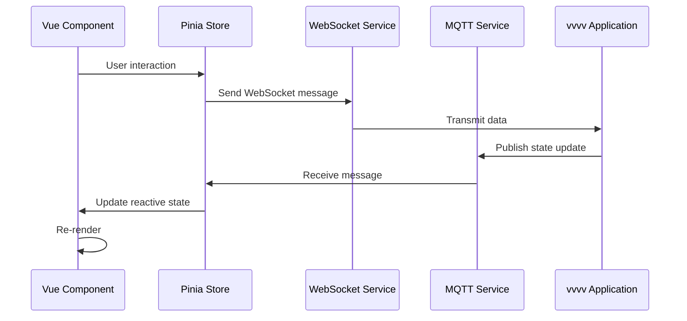

# Vue Webapp Architecture Plan

## Project Overview
Create a modern Vue 3 webapp that communicates with a vvvv application via WebSocket and MQTT protocols. All communication logic will be centralized in a Pinia store for clean state management.

---

## Vue UI Framework Recommendations

### Top Recommendations for Vue 3:

#### 1. **Element Plus** (Recommended)
- **Pros**: Comprehensive component library, excellent documentation, TypeScript support, highly customizable
- **Best for**: Enterprise applications, admin panels, data-heavy interfaces
- **Website**: https://element-plus.org/

#### 2. **Vuetify 3**
- **Pros**: Material Design implementation, extensive components, responsive grid system, active community
- **Best for**: Material Design lovers, mobile-first applications
- **Website**: https://vuetifyjs.com/

#### 3. **PrimeVue**
- **Pros**: 90+ components, multiple themes, excellent data tables, charts integration
- **Best for**: Business applications, dashboards, data visualization
- **Website**: https://primevue.org/

#### 4. **Naive UI**
- **Pros**: TypeScript-first, modern design, good performance, clean API
- **Best for**: Modern web apps, TypeScript projects
- **Website**: https://www.naiveui.com/

#### 5. **Ant Design Vue**
- **Pros**: Enterprise-grade, comprehensive components, Ant Design ecosystem
- **Best for**: Enterprise applications, complex forms
- **Website**: https://antdv.com/

### Recommendation for This Project:
**Element Plus** - Given the vvvv integration context and need for real-time UI updates, Element Plus offers excellent form controls, real-time data display components, and is well-suited for technical/creative tool interfaces.

---

## Technology Stack

### Core Technologies:
- **Vue 3** (Composition API with `<script setup>`)
- **Vite** (Build tool)
- **Pinia** (State management)
- **TypeScript** (Type safety)
- **Element Plus** (UI Framework)

### Communication Libraries:
- **native WebSocket API** or **socket.io-client** (WebSocket)
- **mqtt.js** (MQTT over WebSocket)

### Additional Tools:
- **Vue Router** (Navigation)
- **Axios** (HTTP requests if needed)
- **VueUse** (Composition utilities)

---

## Architecture Design

```mermaid
graph TB
    subgraph "Vue Webapp"
        A[Vue Components] --> B[Pinia Store]
        B --> C[WebSocket Service]
        B --> D[MQTT Service]
    end
    
    subgraph "External Communication"
        C --> E[WebSocket Server]
        D --> F[MQTT Broker]
    end
    
    subgraph "vvvv Application"
        E --> G[vvvv WebSocket Node]
        F --> H[vvvv MQTT Node]
    end
    
    style B fill:#42b883
    style C fill:#35495e
    style D fill:#35495e
```



### Communication Flow:



---

## Project Structure

```
Webapp/
├── public/
│   └── favicon.ico
├── src/
│   ├── assets/
│   │   └── styles/
│   │       └── main.css
│   ├── components/
│   │   ├── ui/
│   │   │   ├── ButtonControl.vue
│   │   │   ├── SliderControl.vue
│   │   │   ├── ToggleControl.vue
│   │   │   ├── ColorPicker.vue
│   │   │   └── TextInput.vue
│   │   └── ConnectionStatus.vue
│   ├── services/
│   │   ├── websocket.service.ts
│   │   └── mqtt.service.ts
│   ├── stores/
│   │   ├── communication.store.ts
│   │   └── ui.store.ts
│   ├── types/
│   │   └── index.ts
│   ├── views/
│   │   ├── HomeView.vue
│   │   └── ControlPanel.vue
│   ├── App.vue
│   └── main.ts
├── .gitignore
├── index.html
├── package.json
├── tsconfig.json
├── vite.config.ts
└── README.md
```

---

## Key Features to Implement

### 1. Basic UI Elements Page
- **Button**: Send commands to vvvv
- **Slider**: Control numeric values (0-1, 0-100, custom ranges)
- **Toggle/Switch**: Boolean states
- **Color Picker**: RGB/HSV color selection
- **Text Input**: String data input
- **Number Input**: Numeric data with validation
- **Dropdown/Select**: Enumerated options

### 2. Communication Store (Pinia)
- WebSocket connection management
- MQTT connection management
- Message queue handling
- Reconnection logic
- Connection status tracking
- Message history/logging

### 3. Real-time Features
- Live connection status indicator
- Bidirectional data flow
- Automatic reconnection
- Error handling and notifications
- Message acknowledgment

---

## Communication Protocol Design

### WebSocket Messages (JSON format):
```json
{
  "type": "control",
  "component": "slider",
  "id": "brightness",
  "value": 0.75,
  "timestamp": 1234567890
}
```

### MQTT Topics Structure:
```
vvvv/webapp/controls/button/{id}
vvvv/webapp/controls/slider/{id}
vvvv/webapp/controls/toggle/{id}
vvvv/webapp/controls/color/{id}
vvvv/webapp/status/connection
vvvv/webapp/feedback/{component_id}
```

---

## Configuration Management

### Environment Variables (.env):
```env
VITE_WEBSOCKET_URL=ws://localhost:8080
VITE_MQTT_BROKER=wss://test.mosquitto.org:8081
VITE_MQTT_CLIENT_ID=vue-webapp-client
VITE_MQTT_TOPIC_PREFIX=vvvv/webapp
```

---

## Development Phases

### Phase 1: Project Setup
- Initialize Vue 3 project with Vite
- Install dependencies (Pinia, Element Plus, MQTT.js)
- Configure TypeScript
- Set up project structure

### Phase 2: Communication Layer
- Implement WebSocket service
- Implement MQTT service
- Create Pinia communication store
- Add connection management logic

### Phase 3: UI Components
- Create basic UI control components
- Implement connection status indicator
- Build control panel layout
- Add Element Plus integration

### Phase 4: Integration & Testing
- Connect UI components to Pinia store
- Test WebSocket communication
- Test MQTT communication
- Add error handling and reconnection logic

### Phase 5: Polish & Documentation
- Add loading states and transitions
- Implement notifications/toasts
- Write usage documentation
- Create example vvvv patch for testing

---

## Testing Strategy

### Manual Testing:
1. Test WebSocket connection with a simple WebSocket server
2. Test MQTT connection with test.mosquitto.org
3. Verify bidirectional communication
4. Test reconnection scenarios
5. Validate UI responsiveness

### Tools for Testing:
- **WebSocket**: Use browser DevTools or wscat
- **MQTT**: Use MQTT Explorer or mosquitto_pub/sub
- **vvvv**: Create test patch with WebSocket and MQTT nodes

---

## Security Considerations

1. **WebSocket**: Use WSS (secure WebSocket) in production
2. **MQTT**: Use authentication if available
3. **Input Validation**: Validate all incoming messages
4. **CORS**: Configure proper CORS headers
5. **Rate Limiting**: Implement message throttling if needed

---

## Future Enhancements

- [ ] Add data visualization (charts, graphs)
- [ ] Implement preset system (save/load configurations)
- [ ] Add keyboard shortcuts
- [ ] Create mobile-responsive layout
- [ ] Add dark/light theme toggle
- [ ] Implement message recording/playback
- [ ] Add multi-client synchronization
- [ ] Create custom UI component builder

---

## Resources & Documentation

### Vue 3:
- Official Docs: https://vuejs.org/
- Composition API: https://vuejs.org/guide/extras/composition-api-faq.html

### Pinia:
- Official Docs: https://pinia.vuejs.org/

### MQTT.js:
- GitHub: https://github.com/mqttjs/MQTT.js
- Documentation: https://github.com/mqttjs/MQTT.js#readme

### vvvv Integration:
- WebSocket nodes in vvvv gamma
- MQTT nodes via VL.IO.MQTT package

---

## Notes

- The webapp will be fully self-contained in the `Webapp/` folder
- All communication logic is centralized in Pinia stores for maintainability
- TypeScript provides type safety for message structures
- Element Plus provides professional UI components out of the box
- The architecture supports easy extension with additional protocols or UI elements
